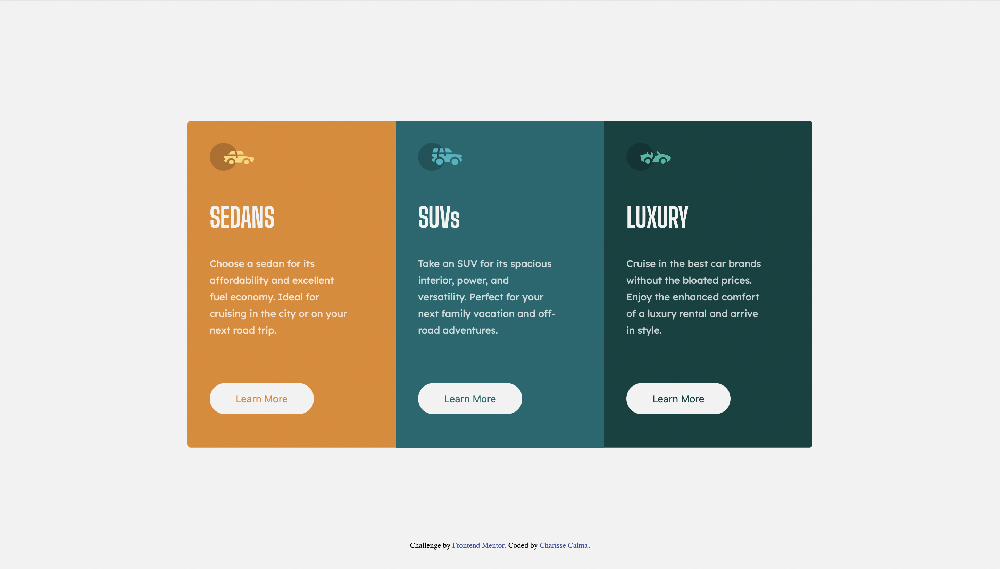

# Frontend Mentor - 3-column preview card component solution

This is a solution to the [3-column preview card component challenge on Frontend Mentor](https://www.frontendmentor.io/challenges/3column-preview-card-component-pH92eAR2-). Frontend Mentor challenges help you improve your coding skills by building realistic projects. 

## Table of contents

- [Overview](#overview)
  - [The challenge](#the-challenge)
  - [Screenshot](#screenshot)
  - [Links](#links)
- [My process](#my-process)
  - [Built with](#built-with)
  - [What I learned](#what-i-learned)
  - [Useful resources](#useful-resources)
- [Author](#author)

## Overview

### The challenge

Users should be able to:

- View the optimal layout depending on their device's screen size
- See hover states for interactive elements

### Screenshot

### Links

- Solution URL: [Add solution URL here](https://your-solution-url.com)
- Live Site URL: [Add live site URL here](https://your-live-site-url.com)

## My process

### Built with

- Semantic HTML5 markup
- CSS custom properties
- Flexbox
- CSS Grid
- Mobile-first workflow

### What I learned
  I recently just learned how to use CSS border-box model and the box-sizing. I found it really helpful especially with sizing
  the elements. I have also started implementing a good practice, which is to make an index css file that has root variables and
  root design. I also found it easier doing so because then I do not need to remember the hex or number I used for the colors.

### Useful resources

- [Box Model Video](https://www.youtube.com/watch?v=rIO5326FgPE) - This helped me with the concept of box model.

## Author

- Website - [Charisse Calma](https://charissec.me)
- Frontend Mentor - [@gamercherrie](https://www.frontendmentor.io/profile/gamercherrie)

